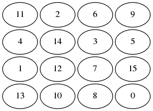
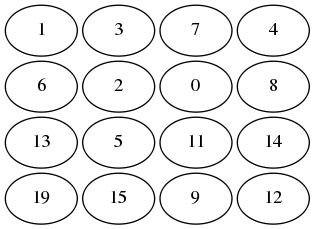

#board1
<pre>
11,2,6,9,4,14,3,5,1,12,7,15,13,10,8,hole
</pre>

#board2
<pre>
1,3,7,4,6,2,hole,8,13,5,11,14,19,15,9,12
</pre>

<pre>
 # python osage.py board1 > board1-graph
 # ./osage.sh board1-graph 
</pre>

<pre>
# python trans.py board1
</pre>

<pre>
set(para_into).
set(para_from).
list(usable).
EQUAL(l(hole,l(n(x),y)),l(n(x),l(hole,y))).
EQUAL(l(hole,l(x,l(y,l(z,l(u,l(n(w),v)))))),l(n(w),l(x,l(y,l(z,l(u,l(hole,v))))))).
-STATE(l(n(1),l(n(2),l(n(3),l(n(4),l(end,l(n(5),l(n(6),l(n(7),l(n(8),l(end,l(n(9),l(n(10),l(n(11),l(n(12),l(end,l(n(13),l(n(14),l(n(15),l(hole,end)))))))))))))))))))).
end_of_list.

list(sos).
STATE(l(n(11),l(n(2),l(n(6),l(n(9),l(end,l(n(4),l(n(14),l(n(3),l(n(5),l(end,l(n(1),l(n(12),l(n(7),l(n(15),l(end,l(n(13),l(n(10),l(n(8),l(hole,l(end))))))))))))))))))))).
end_of_list.
</pre>

<pre>
 # python osage.py board2 > board2-graph
 # ./osage.sh board2-graph 
</pre>

<pre>
# python trans.py board2
</pre>

<pre>
set(para_into).
set(para_from).
list(usable).
EQUAL(l(hole,l(n(x),y)),l(n(x),l(hole,y))).
EQUAL(l(hole,l(x,l(y,l(z,l(u,l(n(w),v)))))),l(n(w),l(x,l(y,l(z,l(u,l(hole,v))))))).
-STATE(l(n(1),l(n(2),l(n(3),l(n(4),l(end,l(n(5),l(n(6),l(n(7),l(n(8),l(end,l(n(9),l(n(10),l(n(11),l(n(12),l(end,l(n(13),l(n(14),l(n(15),l(hole,end)))))))))))))))))))).
end_of_list.
list(sos).
STATE(l(n(1),l(n(3),l(n(7),l(n(4),l(end,l(n(6),l(n(2),l(hole,l(n(8),l(end,l(n(13),l(n(5),l(n(11),l(n(14),l(end,l(n(19),l(n(15),l(n(9),l(n(12),l(end))))))))))))))))))))).
end_of_list.
</pre>