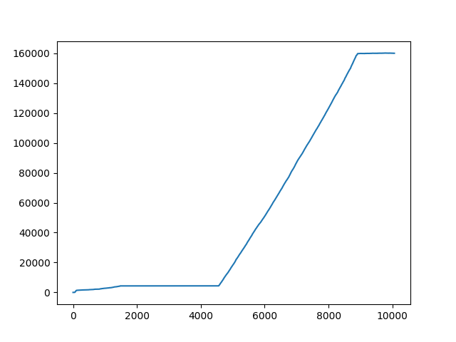
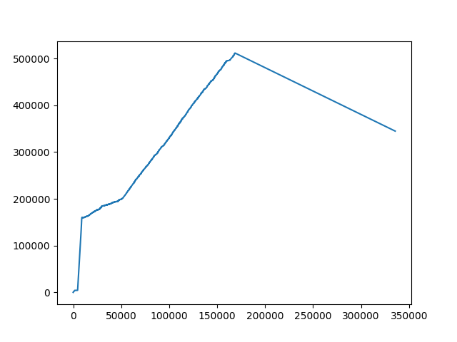
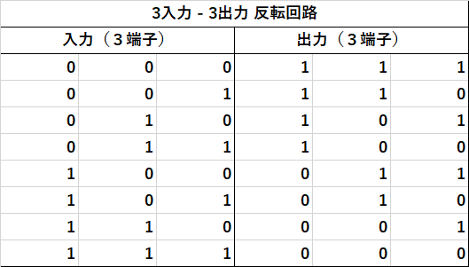
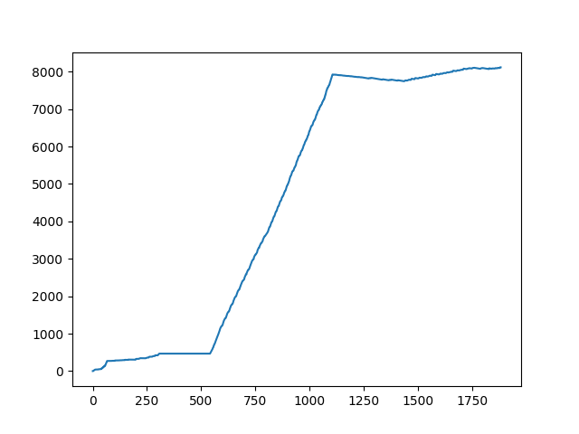
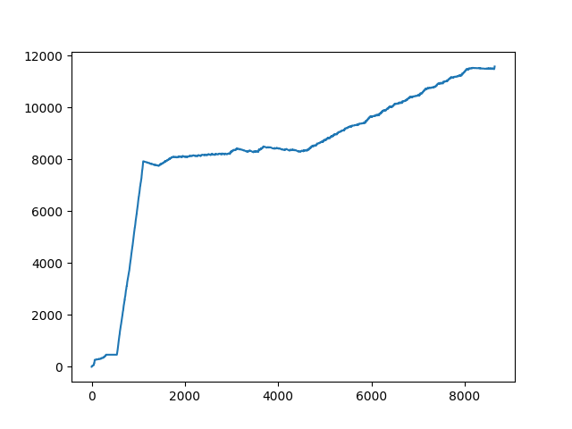

# 10カウンタ回路の生成

 

# UR resolution (BCD) - sos size

<pre>
-------------- statistics -------------
clauses given                  0
clauses generated        5347949
  ur_res generated       5347949
demod & eval rewrites    5383579
clauses wt,lit,sk delete       0
tautologies deleted            0
clauses forward subsumed 5177890
  (subsumed by sos)      1842716
unit deletions                 0
factor simplifications         0
clauses kept              180120
new demodulators               0
empty clauses                  1
clauses back demodulated       0
clauses back subsumed          0
usable size                10065
sos size                  160002
demodulators size              2
passive size                   2
hot size                       0
Kbytes malloced            79101

----------- times (seconds) -----------
user CPU time        229.45          (0 hr, 3 min, 49 sec)
system CPU time        0.13          (0 hr, 0 min, 0 sec)
wall-clock time      229             (0 hr, 3 min, 49 sec)
</pre>

# hyper resolution (BCD) - sos size

<pre>
-------------- statistics -------------
clauses given                  0
clauses generated        287084274
  hyper_res generated    287084274
demod & eval rewrites    288422196
clauses wt,lit,sk delete       0
tautologies deleted            0
clauses forward subsumed 286403743
  (subsumed by sos)      44200930
unit deletions                 0
factor simplifications         0
clauses kept             1016164
new demodulators               0
empty clauses                  1
clauses back demodulated       0
clauses back subsumed          0
usable size               335638
sos size                  344900
demodulators size              2
passive size                   2
hot size                       0
Kbytes malloced           311523

----------- times (seconds) -----------
user CPU time      25959.87          (7 hr, 12 min, 39 sec)
system CPU time        2.00          (0 hr, 0 min, 2 sec)
wall-clock time    25962             (7 hr, 12 min, 42 sec)

That finishes the proof of the theorem.
</pre>

# 3入力3出力反転回路の生成(Two inverterパズル）

# UR resolution (two-inv) - sos size

<pre>
Search stopped by max_proofs option.

============ end of search ============

-------------- statistics -------------
clauses given                  0
clauses generated         342935
  ur_res generated        342935
demod & eval rewrites     349903
clauses wt,lit,sk delete       0
tautologies deleted            0
clauses forward subsumed  332937
  (subsumed by sos)        77452
unit deletions                 0
factor simplifications         0
clauses kept               11881
new demodulators               0
empty clauses                  1
clauses back demodulated       0
clauses back subsumed          0
usable size                 1887
sos size                    8118
demodulators size              2
passive size                   1
hot size                       0
Kbytes malloced             7812

----------- times (seconds) -----------
user CPU time          3.99          (0 hr, 0 min, 3 sec)
system CPU time        0.00          (0 hr, 0 min, 0 sec)
wall-clock time        4             (0 hr, 0 min, 4 sec)

That finishes the proof of the theorem.

</pre>

# Hyper resolution (two-inv) - sos size

<pre>
earch stopped by max_proofs option.

============ end of search ============

-------------- statistics -------------
clauses given                  0
clauses generated        2069334
  hyper_res generated    2069334
demod & eval rewrites    2103338
clauses wt,lit,sk delete       0
tautologies deleted            0
clauses forward subsumed 2049117
  (subsumed by sos)       314773
unit deletions                 0
factor simplifications         0
clauses kept               28858
new demodulators               0
empty clauses                  1
clauses back demodulated       0
clauses back subsumed          0
usable size                 8646
sos size                   11577
demodulators size              2
passive size                   1
hot size                       0
Kbytes malloced            12695

----------- times (seconds) -----------
user CPU time         25.31          (0 hr, 0 min, 25 sec)
system CPU time        0.01          (0 hr, 0 min, 0 sec)
wall-clock time       26             (0 hr, 0 min, 26 sec)

That finishes the proof of the theorem.

Process 25586 finished Tue Oct 13 20:55:36 2020
</pre>
